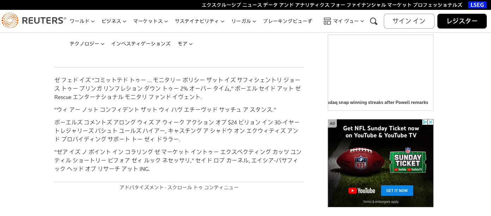

# wasei-eigo

Transcribe webpages into katakana カタカナ as you browse, using the power of OpenAI.

## Installation

Follow the instructions [here](https://developer.chrome.com/docs/extensions/mv3/getstarted/development-basics/#load-unpacked) to load the extension into Chrome from source. Then, create an OpenAI API key [here](https://platform.openai.com/api-keys), click the extension icon, paste your API key, and click Save.

Be aware that this will charge you for any usage! Check your OpenAI usage limits to avoid unexpectedly high bills. To stop transcribing webpages, uninstall the extension or clear the API key and click Save.

## Why?

Chrome has Google Translate built-in, of course. But why stop there? We can do any linguistic transformation we want just by swapping out prompts. They're called Large "Language" Models after all.

On my last trip to Japan, I received a travel tip from a friend. "Learn katakana," he said. "You can do it in a couple hours and half of the words on restaurant menus are just English written in katakana so you'll have a much easier time ordering stuff. Trust me, it's worth it."

While it ended up taking me more than a couple hours (I used [this](https://kana-quiz.tofugu.com/) guide, knock yourself out), it was certainly time well-spent.

But what do you do after returning from Japan and losing that immersion that's so critical to making language progress? You could sign up for a real language class...or set your iPhone to Japanese...or use this extension.

Not only does GPT-4 have a surprisingly good "understanding" of phonetics, it has all sorts of other linguistic tricks up its sleeve! We can make it translate a random 5% of words on the page into Spanish, or replace as many words as possible with verbose SAT vocab equivalents, or translate 15% of words into Mandarin Chinese in pinyin with Han character equivalents in parentheses. The possibilities are endless.

## Disclaimer

This is very much a fun proof-of-concept and not at all robust or production-ready. It's as much an exercise in learning Chrome extensions as anything else.

This software is provided for educational purposes only and is provided "AS IS", without warranty of any kind, express or implied, including but not limited to the warranties of merchantability, fitness for a particular purpose and noninfringement. in no event shall the authors or copyright holders be liable for any claim, damages or other liability, whether in an action of contract, tort or otherwise, arising from, out of or in connection with the software or the use or other dealings in the software.